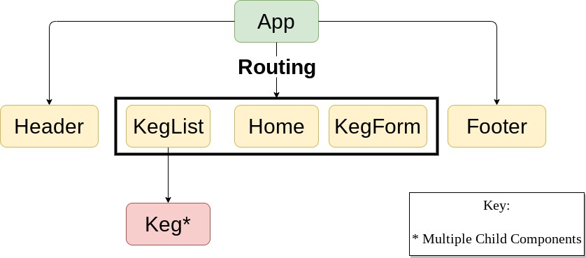

This project was bootstrapped with [Create React App](https://github.com/facebook/create-react-app).
# React Week 2 Code Review

#### _TapRoom_, _February 2020_

#### By _**Tyler Yates**_

## Description

_Lets a user view and add kegs to a list_

## Setup/Installation Requirements

Currently the project can be accessed by downloading or cloning the repository at github [here](https://github.com/YTyler/reactWeek2.git) and running the following commands in the root directory via the terminal

`npm install`  
`npm start`

The repository can be found

## Project Structure  

## Known Bugs

* No known bugs at this time

## Support and contact details

_The author can be contacted at tyates907@gmail.com_

## Technologies Used

* Javascript (React)

### License

MIT License

Copyright (c) 2019 Tyler Yates

*Permission is hereby granted, free of charge, to any person obtaining a copy
of this software and associated documentation files (the "Software"), to deal
in the Software without restriction, including without limitation the rights
to use, copy, modify, merge, publish, distribute, sublicense, and/or sell
copies of the Software, and to permit persons to whom the Software is
furnished to do so, subject to the following conditions:*

The above copyright notice and this permission notice shall be included in all
copies or substantial portions of the Software.

THE SOFTWARE IS PROVIDED "AS IS", WITHOUT WARRANTY OF ANY KIND, EXPRESS OR
IMPLIED, INCLUDING BUT NOT LIMITED TO THE WARRANTIES OF MERCHANTABILITY,
FITNESS FOR A PARTICULAR PURPOSE AND NONINFRINGEMENT. IN NO EVENT SHALL THE
AUTHORS OR COPYRIGHT HOLDERS BE LIABLE FOR ANY CLAIM, DAMAGES OR OTHER
LIABILITY, WHETHER IN AN ACTION OF CONTRACT, TORT OR OTHERWISE, ARISING FROM,
OUT OF OR IN CONNECTION WITH THE SOFTWARE OR THE USE OR OTHER DEALINGS IN THE
SOFTWARE.
